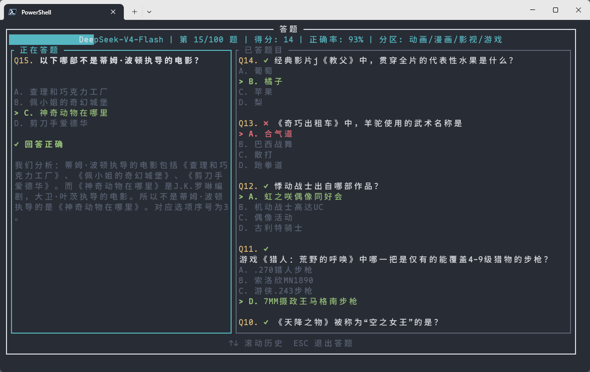

# Bili-Hardcore

B 站硬核会员自动答题工具，利用 LLM 实现智能答题功能。默认提供原生桌面 GUI，并保留终端界面。

## 使用前须知
- 请确保您的 B 站账号已满 6 级，根据 B 站规则，6 级用户才可以进行硬核会员试炼
- 硬核会员试炼每天有 3 次答题机会，达到限制后需要 24 小时后才能重新答题，具体时间可以前往 B 站 APP 答题页面查看
- 没有 API Key 的可以免费去硅基流动注册一个账号，会送 14 元免费额度，这是我的[邀请链接](https://cloud.siliconflow.cn/i/9Fur0aVC)

## 安装

> 之前用过 0.x 版本的老用户请先删除配置文件：
> ```bash
> # macOS / Linux
> rm -rf ~/.bili-hardcore
> ```
> ```powershell
> # Windows (PowerShell)
> Remove-Item -Recurse -Force "$env:USERPROFILE\.bili-hardcore"
> ```


### 快速安装（推荐）

**macOS / Linux:**
```bash
curl -fsSL https://github.com/Karben233/bili-hardcore/releases/latest/download/install.sh | bash
```

**Windows (PowerShell):**
```powershell
irm https://github.com/Karben233/bili-hardcore/releases/latest/download/install.ps1 | iex
```

### 手动下载

前往 [Releases](https://github.com/Karben233/bili-hardcore/releases/latest) 下载对应平台的文件：

| 平台 | 推荐文件 |
|------|---------|
| macOS (Intel / Apple Silicon) | `bili-hardcore-*-darwin-universal.tar.gz` |
| Windows (x64) | `bili-hardcore-*-windows-x64.zip` |
| Linux (x64, GUI + TUI) | `bili-hardcore-*-linux-x64.tar.gz` |
| Linux (ARM64, GUI + TUI) | `bili-hardcore-*-linux-arm64.tar.gz` |
| Linux (musl, 仅 TUI) | `bili-hardcore-*-linux-*-musl.tar.gz` |

解压后赋予执行权限即可运行：
```bash
chmod +x bili-hardcore
./bili-hardcore
```

> **macOS 提示**: 如遇"无法验证开发者"，执行 `xattr -cr /path/to/bili-hardcore`
> **Linux 提示**: GUI 版本使用 glibc 并需要图形桌面/X11；`-musl` 是无 GUI 的静态 TUI 兼容版本。

### 从源码构建

需要 Rust 1.88 及以上版本：

```bash
git clone https://github.com/Karben233/bili-hardcore.git
cd bili-hardcore
cargo build --release
./target/release/bili-hardcore
```

仅构建 TUI（适合 musl 或无图形环境）：

```bash
cargo build --release --no-default-features
./target/release/bili-hardcore --tui
```

## 使用

### 启动
```bash
bili-hardcore                    # 启动桌面 GUI
bili-hardcore --tui              # 启动终端界面
bili-hardcore <url> <model> -k <api-key>   # 保存配置并启动 GUI
bili-hardcore --tui <url> <model> -k <api-key>  # 保存配置并启动 TUI
```

### 命令
```bash
bili-hardcore update             # 检查并更新到最新版本
bili-hardcore uninstall          # 卸载
```

## 运行截图

